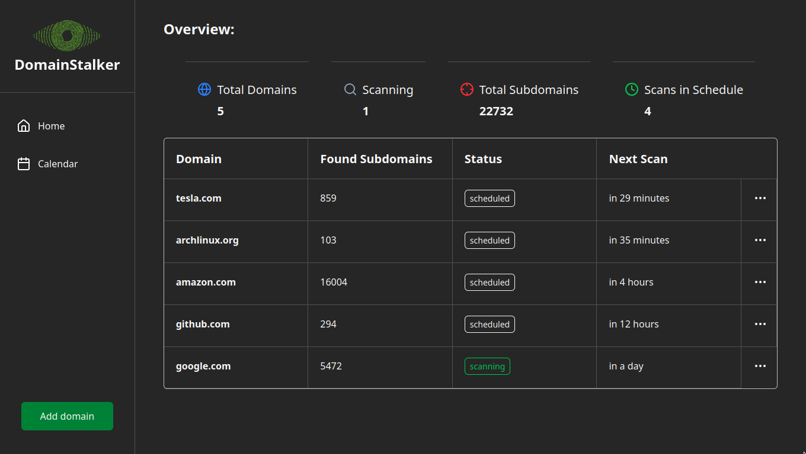

**DomainStalker** is an automation tool to periodically scan for new subdomains on the given domains.

## Tech Stack
- NextJS
- Postgres
- Bullmq + Redis



## INSTALLING

### Prerequisites
- docker
- nodejs
- pnpm

#### Database Setup
spin up a postgres and redis container:
```bash
docker run --name domainstalker-postgres -p 5432:5432 -e POSTGRES_PASSWORD=mysecretpassword -v $(pwd)/packages/db/createDB.sql:/docker-entrypoint-initdb.d/init.sql -d postgres
docker run --name domainstalker-redis -p 6379:6379 -d redis 
```
> [!WARNING]
> if you changed container ports, update the `.env` file in the root directory

#### Clone and Run
clone the repo, install dependencies and run it:
```bash
git clone https://github.com/seyedmahditayebi/domainstalker
cd domainstalker
pnpm i
pnpm start
```
you can visit website at http://localhost:3000
